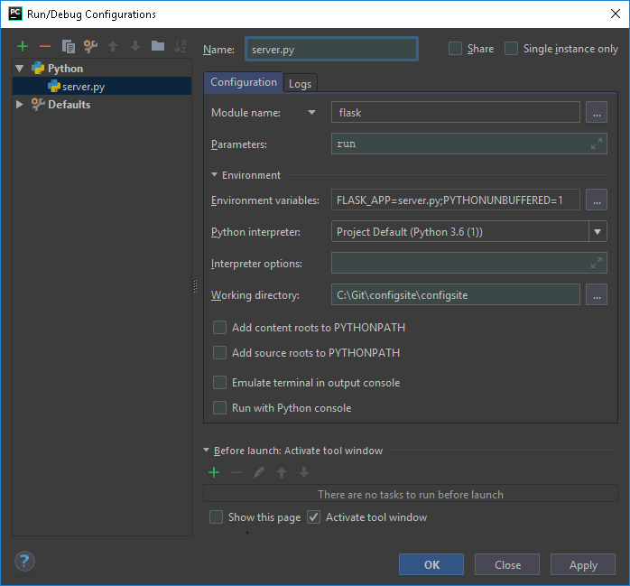

# Configserver
A small server that handles configurations.  
I had to bash my head against the wall a lot learning how to use the various technologies used in this project. Hopefully you won't have to.

This giode assumes some level of familiarity with Python, Docker, and Git.

# Background information
__Requirement__: Prototype a server exposed from a local port, that serves a configuration form.
* The server needs to be easily installable and reinstallable.
* The server needs to run at startup. 
* The server needs to be developped on Windows (using WSL) or Linux arm64 and it needs to run on ARM architecture. 
* The server should cross-packageable.

__Server host__: Debian on ARM.  
__Development platform__: WSL, Pycharm, and Linux  
__Technologies selected__: Flask, Jinja2, Gunicorn, dh-virtualenv, systemd, docker, qemu

[Flask](https://github.com/pallets/flask) is a "Python micro framework for building web applications".  
[Jinja2](http://jinja.pocoo.org/docs/2.10/) Used by flask, it is a macro language that processes HTML files.  
[Gunicorn](https://github.com/benoitc/gunicorn/) is an easy to use server.  
[dh-virtualenv](https://github.com/spotify/dh-virtualenv) is a utility that installs python virtual environments in Debian packages. Debian packages are a mechanism to install software.  
[Systemd](https://en.wikipedia.org/wiki/Systemd) ~~is a monster eating Linux~~ is a built-in mechanism in many Linux systems that will load the server on startup and help keeping it alive.  
[Docker](https://www.docker.com/) is "a computer program that performs operating-system-level virtualization also known as containerization". It will be used to create sterile packing environments.  
[Qemu](https://www.qemu.org/) will help us emulate an arm architecture because apparently cross-packing python is [hard](https://github.com/spotify/dh-virtualenv/issues/233). Builds will fail sometimes for no reason. Don't despair, and re-run the container. Have a better idea? Give me a call. ___please___.

## In summary
The server's backend will be written in Python (`python3`), using `Flask`. The server will be ran with `gunicorn`. The server will be cross-packaged using `Docker`, `qemu`, and `dh-virtualenv`.

# Files explained
`.dockerignore`: Tell docker to ignore everything other than files we need, located in dockerfiles/dockcross and the dockerfiles themselves. It's helpful to have your dockerfiles in the docker context so you can perform optional copies as described here: https://www.drivenbycode.com/flexible-docker-images-with-optional-copy/

`.gitignore`: A bunch of files to ignore.

`readme.md`: This file...

`requirements.txt`: A list of required Python packages to be installed in the virtual environment installed by the created Debian package. Created from a virtual environment containing everything the project needs using `pip freeze > requirements.txt`

`setup.py`: A Python setup file, utilized by `dh-virtualenv` to create the Python package.

`configsite/__init__.py`: Defines the directory as a Python package.

`configsite/configmaker.py`: Helper script that handles creating configurations from forms.

`configsite/exceptions.py`: Defines exceptions to be used by the package.

`configsite/server.py`: The server itself. It's very simple, although you won't know how to construct a simple server using flask's documentation. This tiny example from Mozilla was a godsend: https://developer.mozilla.org/en-US/docs/Learn/HTML/Forms/Sending_and_retrieving_form_data

>#### Explanation:
>```python
>@app.route('/', methods=['GET', 'POST'])
> def form():
>	existing_config = config_maker.existing_config
>	return render_template('form.html', existing_config=existing_config)
>```
> Makes a webpage with the name `/` in your domain, with the methods get and post, and bind it to the function `form`. Once the page is loaded, the function is ran in the backend. The function `form()` returns the result of the funtion `render_template('form.html', existing_config=existing_config)`, which is an HTML page, "rendered" from the template using a macro language called [Jinja2](http://jinja.pocoo.org/docs/2.10/). Variables can be explicitly (`existing_config=existing_config`), but some are passed implicitly, like the function `url_for`. Not sure why. Variables are expanded in the HTML template using `{{variable}}`, and you can put in control flows too. Look at the forms for examples.

`configsite/wsgi.py`: An entry point required by gunicorn. 

`configsite/jsons/config.json`: The final output of our little project, a configuration file to be consumed by _some_ other program.

`configsite/jsons/default_config.json`: A default configuration to fall back on.

`configsite/jsons/schema.json`: A json schema, a simple mechanism to check the validity of configurations.

`configsite/templates`: Flask will look for templates here by default.

`configsite/templates/error.html`: A template containing the error page. Note that it uses Jina2's `for in` loop.

`configsite/templates/form.html`: An example form that utilizes various HTML form objects. Note `<form method="post" action="{{ url_for('success') }}">`. The action will be rendered to the url page bound to `success`.

`configsite/templates/success.html`: Success!

`debian/changelog`: Required by debian packages, I'm not using it to its fullest extent. It should contain information about releases and probably be automatically incremented.

`debian/compat`: I think it tells `dh` what version of standards the package was written for, incremented with versions of debian. Tutorials say to use `9`, although `10` is an option.

`debian/configsite.install`: Tells `dh` what additional (that is, not handled by dh-helper scripts) files you want installed.  
__Giant pitfall__: when file has an executable permission (like on WSL on a mounted drive with no metadata) `dh` executes it and expects it to echo configuration lines instead of listing them. I had to consult an [arcane wizard](https://bugs.debian.org/cgi-bin/bugreport.cgi?bug=902214).

`debian/configsite.service`: A systemd unit file, automatically picked up and installed by `dh`. I had to install the package once to learn exactly where it will be installed, to know what paths to put in it. The variables are arcane, gathered from multiple and conflicting "how to create systemv unit file" guides.

`debian/configsite.triggers`: tells dpkg what packages you're interested in. The package currently only says that it wants `python3`, althought it probably requires `python3-venv` too. Need to test that. __Crappy pitfall__: File has to end with newline.

`debian/control`: Arcane, not sure what the difference between it and `debian/configsite.triggers` is. It claims to do things like tell you what packages are required.

`debian/rules`: A makefile. Currenlty just says to use `dh` on the target with some additional flags.

>#### A note about the dockerfiles:
> They'll try to install configsite .deb packages if they find them in the `/dockerfiles` folder. It's just a convenience thing, originally intended to test the systemd unit files. However, docker doesn't use systemd...


`dockerfiles/configsite-debian-arm32v7.dockerfile`: A docker file for cross-packing this project.

`dockerfiles/configsite-debian-x64.dockerfile`: A docker file for cross-packing this project.

`dockerfiles/configsite-linux-x64.dockerfile`: A docker file for cross-packing this project.

`dockerfiles/dockcross/dockcross`: The [dockcross](https://github.com/dockcross/dockcross/) helper script... It doesn't have to be here, I'm just used to working with dockcross by now.

`dockerfiles/dockcross/entrypoint.sh`: The dockcross entry point.

`init.d/configsite`: A `systemv` config file, it's not used since the server is installed on a machine that uses `systemd`.

`init.d/readme.md`: Explains the above.

# Prequisites:
```bash
# One-time requirements installation.
# Install packages required to develop.
sudo apt-get install -y python3 python3-venv
# Install packages required to locally package on your machine
sudo apt-get install -y debhelper dh-virtualenv dpkg-dev
# Install packages required to cross-package.
sudo apt-get install -y qemu-user-static binfmt-support
mkdir temp
cd temp
git clone git@github.com:docker/docker-install.git
cd docker-install
chmod +x get-docker.sh
./get-docker.sh
sudo usermod -aG docker $USER
cd ../..
rm -rf temp
# You have to log out from linux to allow docker to run without sudo
```

# Running the project:
Linux:
```bash
# Installing a new venv in the project directory:
python3 -m venv venv
# Activating a venv session:
. venv/bin/activate
# Installing all requirements in venv:
pip install -r requirements.txt
# Starting the server manually:
gunicorn --bind 0.0.0.0:8000 wsgi:app
```

Windows, for development purposes:
```bat
REM Installing a new venv in the project directory:
py -3 -m venv venv
REM Activating a venv session:
venv\Scripts\activate
REM Installing all requirements in venv:
py -m pip install -r requirements.txt
```

# Packaging:
```bash
# Updating and running the debian arm32v7 container (using dockcross entry point).
docker kill $(docker ps -q)
docker build -f dockerfiles/configsite-debian-arm32v7.dockerfile -t configsite-debian-arm32v7 .
docker run --rm configsite-debian-arm32v7 > configsite-debian-arm32v7 ; chmod +x configsite-debian-arm32v7
./configsite-debian-arm32v7 -a "-p 127.0.0.1:8000:8000/tcp" bash
```

```bash
# Updating and running the Ubuntu container (using dockcross entry point).
docker kill $(docker ps -q)
docker build -f dockerfiles/configsite-linux-x64.dockerfile -t configsite-linux-x64 .
docker run --rm configsite-linux-x64 > configsite_docker ; chmod +x configsite_docker
./configsite_docker -a " -p 127.0.0.1:8000:8000/tcp " bash
```

```bash
# Building the package from inside a container and copying it to /dockerfiles.
# This WILL fail sometimes if you're using qemu when emulating ARM. It's just qemu being crappy. Try again.
dpkg-buildpackage -us -uc -b
cp ../configsite*.deb /work/dockerfiles
exit
# Congratulations, /dockerfiles should now have a debian package ready to be installed.
```

```bash
#Manually running the server from within a container, since docker doesn't use systemd.
cd /opt/venvs/configsite/lib/python3.5/site-packages/configsite
/opt/venvs/configsite/bin/gunicorn --bind 0.0.0.0:8000 wsgi:app
```

# Installing the package

If you followed the packaging instructions, you should have a debian package located in `/dockerfiles`.
If you want to install the resulting package in your actual machine or anywhere else, simply run `dpkg -i configsite_0.1-1_<architecture>.deb` from a directory containing that file.[^1]

[^1]: `<architecture>` being the appropriate architecture the package was built for.

# Debugging flask in Pycharm
A bit complicated. Pycharm doesn't recognize virtual environment declerations on my machine (conda included) so I'm using the global interpreter. For debugging I have to change  the `Script path:` to `Module name:` using the little arrow next to it, and use the following:



See also https://github.com/pallets/flask/blob/f52f3ef31dccd16001b7306c4b00859f585ffd67/docs/cli.rst#pycharm-integration
